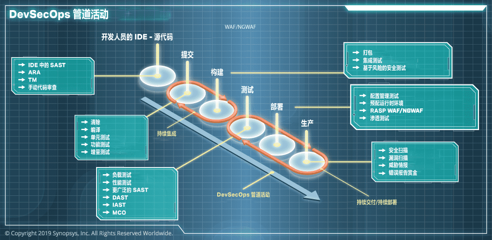
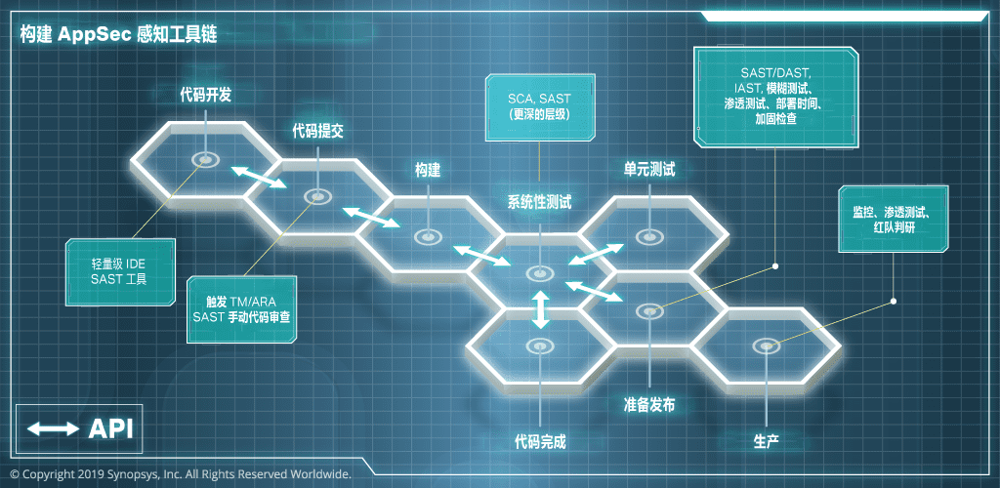

### **DevSecOps（开发-安全-运维）**  

**DevSecOps**（Development + Security + Operations）是**在 DevOps 过程中集成安全性**的一种实践。它的核心理念是：  
> **安全应贯穿于软件开发生命周期（SDLC）的每个阶段，而不是作为事后补救。**  

传统 DevOps 关注 **CI/CD 和运维自动化**，但安全通常是开发完成后才进行测试（容易遗漏漏洞）。DevSecOps 则在开发的**每个阶段**都引入安全机制，使安全性成为**开发人员的责任，而不仅仅是安全团队的任务**。  

---

## **DevSecOps 的核心原则**
✅ **Shift Left（安全左移）**：尽早在开发阶段进行安全测试，减少修复成本。  
✅ **自动化安全检测**：在 CI/CD 中集成 SAST（静态分析）、DAST（动态分析）等工具。  
✅ **持续监控**：在生产环境实时监控安全风险，如日志分析、入侵检测（IDS）。  
✅ **最小权限原则（Least Privilege）**：限制用户和系统的访问权限，降低风险。  
✅ **合规性检查**：符合 GDPR、ISO 27001、SOC 2 等安全标准。  

---

## **DevSecOps 实施步骤**
### **1. 代码阶段**
🔹 **SAST（静态应用安全测试）**：检查代码中的安全漏洞（如 XSS、SQL 注入）。  
🔹 **依赖检查（SCA，Software Composition Analysis）**：扫描第三方库中的已知漏洞（如 `npm audit`）。  
🔹 **代码签名**：确保代码未被篡改。  

### **2. 构建阶段**
🔹 **容器安全扫描**（如 `Trivy`）：确保 Docker 镜像无漏洞。  
🔹 **CI/CD 安全**（如 GitHub Actions、Jenkins）：限制敏感信息暴露，如 API Key。  
🔹 **基础设施即代码（IaC）安全**（如 Terraform 代码扫描）。  

### **3. 测试阶段**
🔹 **DAST（动态应用安全测试）**：模拟黑客攻击，测试 API 和 Web 应用的漏洞（如 OWASP ZAP）。  
🔹 **IAST（交互式应用安全测试）**：结合 SAST 和 DAST，提高检测精度。  
🔹 **Fuzzing 测试**：向应用程序输入随机数据，检测未处理的异常。  

### **4. 部署 & 运行阶段**
🔹 **WAF（Web 应用防火墙）**：拦截恶意请求（如 Cloudflare、AWS WAF）。  
🔹 **RASP（运行时应用自我保护）**：在应用运行时自动阻止攻击（如 Contrast Security）。  
🔹 **日志分析 & SIEM（安全信息和事件管理）**：检测异常行为。  
🔹 **零信任（Zero Trust）**：所有访问请求必须进行身份验证。  

---

## **DevSecOps 工具链**
| **类别** | **工具示例** |
|---------|-----------|
| **SAST（静态分析）** | SonarQube, Checkmarx, Fortify |
| **DAST（动态分析）** | OWASP ZAP, Burp Suite |
| **SCA（依赖安全扫描）** | Snyk, WhiteSource, Dependabot |
| **容器安全** | Trivy, Aqua Security |
| **基础设施安全（IaC）** | Terraform Scanner, Checkov |
| **CI/CD 安全** | GitHub Actions Secrets, HashiCorp Vault |
| **日志 & 监控** | Splunk, ELK, Datadog |

- 持续集成和编排: Jenkins，Bamboo
- 静态应用程序安全测试(SAST): Coverity，Fortify，FindBugs，Checkmarx
- 源代码构建：Maven，Gradle，MSBuild，gcc
- 构件管理：JFrog Artifactory，Sonatype Nexus
- 源代码管理(SCM)：Git，Subversion，Clearcase
- 云计算技术：AWS，Azure，Google
- 连续交付(CD)：Spinnaker，Jenkins，Bamboo
- 动态应用程序安全测试(DAST)：Webinspect，Burp suite，Acunetix
- 交互式应用程序安全测试(IAST)：Seeker，Checkmarx，Contrast Security
- 虚拟化 Virtualization：VMWare，Vagrant
- 配置管理：Chef，Puppet
- 基础设施管理：Terraform，Ansible
- 软件组成分析(SCA)：Sonatype CLM，OWASP Dependency Check，Black Duck Hub
- 容器化：Docker

---

## **DevSecOps vs. DevOps**
| **对比项** | **DevOps** | **DevSecOps** |
|-----------|----------|-------------|
| **关注点** | 开发 & 运维自动化 | 在 CI/CD 中集成安全 |
| **安全性** | 事后测试 | 开发时内置安全 |
| **工具** | CI/CD、自动化测试 | SAST、DAST、SCA、安全监控 |
| **目标** | 快速交付 | 安全 + 快速交付 |

---

## **为什么 DevSecOps 重要？**
🚀 **降低安全风险**：在开发阶段发现漏洞，减少生产环境风险。  
💰 **节约成本**：安全左移，减少事后修复的代价。  
⚡ **提升合规性**：符合行业安全标准，如 GDPR、ISO 27001。  
📈 **增强团队协作**：让开发、运维和安全团队共同负责安全。  

## 业务驱动因素
DevSecOps 的实现需要业务和运营决策的支持。DevSecOps 的业务驱动因素包括：
- 减少开发、安全和运营团队之间的摩擦，减少设置流程、管道以及协调两者的策略之间的摩擦。
- 提高产品发布的速度，使有竞争力的新特性、修复了关键漏洞的增强版本更快地到达最终用户。
- 确保发布的版本具有市场所需的质量和健壮性。
- 以经济高效的方式使用现有的基础架构，同时提供运行多种类型应用程序所需的平台。

## 业务挑战
- DevSecOps 涉及一些额外的考虑因素，比如平衡安全软件和合规需求，清楚地描绘出谁拥有预算方面的资源，以及让高级管理层参与其中。
- DevSecOps 实现需要大量的投资，并且需要更长的时间来展示其能够带给业务的优势。实现 DevSecOps 投资的回报是一个棘手的问题。
- 由于 DevSecOps 活动是基于协作原则的，因此有时获得具有正确技能集的新资源是具有挑战的。
- 工作内容的更改也可能面临一些来自不同团队的阻力，这可能会进一步阻碍 DevSecOps 被接受。

## 技术驱动因素
- 当 DevSecOps 实现的目标是提供更快的发布和部署时，流程中的自动化活动为其提供了支持。自动化是从传统较慢的手动活动向工具和系统的可配置集成转变的主要驱动因素。
- 更快地生产安全、健壮软件的管道依赖于能力工具、其定制能力，以及它们与管道的其他组件集成的容易程度。因此，市场上此类工具的可用性推动了某些决策。
- 可以使用各种基础架构工具类来实现有效利用资源，这些资源可以应对提高的发布速度。使用市场上基础架构和配置管理工具也会影响 DevSecOps 计划。
- 因为 DevSecOps 实现需要时间来展示它的优势，所以持续报告和度量对于显示里程碑和进度很重要。

## 技术挑战
- 开源与商业工具：在免费可定制工具和具有良好支持的付费工具之间需要权衡。
- 市场上有大量的工具可供选择，使得比较这些可用选项变得令人难以选择和困惑。
- 组织已经投资的现有工具可能无法提供与其他开箱即用系统一样的功能和集成便利性。
- 需要定制工具来满足报告和仪表板中显示结果的要求。

## 各个角色指责变化

### 开发
#### 传统：
- 编写程序源代码，构建实现功能需求的应用程序。
- 根据需要在集中管理的存储库中提交和获取源代码。
- 响应安全和质量团队报告的缺陷和安全错误，并在即将发布的版本中修复这些问题。
#### DevSecOps：
- 完成防御编程方面的培训，知道如何安全地编写代码。
- 在本地开发环境中运行 SAST 工具，并修复明显的安全和质量错误。
- 触发集成构建，合并整个团队的代码并运行 SAST 检查。
- 修复不同类型扫描（例如 SAST、DAST 和 SCA）报告中的问题。

### 安全
#### 传统：
- 搭建和维护各种安全工具以进行安全评估（例如 SAST、DAST 和 IAST）。
- 设计并执行开发人员和管理人员可接受的安全活动计划（例如渗透测试、架构设计审查和网络测试），并发布这些计划。
- 执行安全活动，并尽可能与产品或软件版本保持一致。
- 如果时间允许，定制安全工具来调优结果，从而减少误报数量。
#### DevSecOps：
- 在 DevSecOps 管道中设置和集成安全工具，并使之实现自动配置和更新。
- 定制安全工具来微调结果以减少误报。
- 确保安全类错误被重视并以和其他功能缺陷相同的方式进行处理；确保仅在满足错误修复的总体标准时才发布版本。
- 通过培训、指导页面和定制的安全编码准则的方式，支持开发人员解决安全错误。

### 运维
#### 传统：
- 为不同类型的系统（例如：集成服务器、测试服务器、生产服务器、托管安全工具的计算机和移动设备）分配所需配置、内存、网络和安装软件的新虚拟机和/或设备。
- 根据来自不同团队的部署请求，为每个区域或服务器运行部署脚本。
- 维护部署服务器上的网络安全控制（例如防火墙和 SSL 证书）。
- 打包用于交付的软件，并将发布版本放在中心代码仓库中。
#### DevSecOps：
- 将基础架构管理工具集成到 DevSecOps 管道中。
- 监控由技术主管一键触发的自动化部署。
- 对基础架构执行安全测试，并将测试集成到 DevSecOps 管道中。
- 审查、监控和修复由于部署环境中的更改而引起的安全问题。

