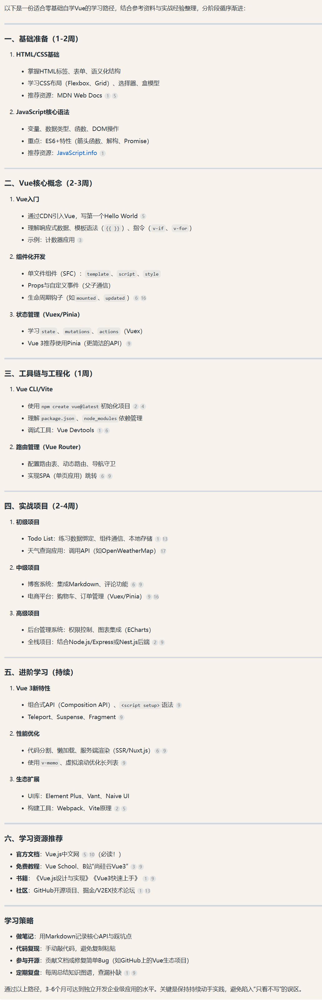

# 前端
## 对于前端初学者学习路线建议

### 1. 先学习HTML、CSS
- youtube教程：https://www.youtube.com/watch?v=G3e-cpL7ofc
- [freecodecamp教程](https://www.freecodecamp.org/): 互动性强

### 2. 再学习JavaScript、TypeScript
[Asa推荐不错的js教程](https://zh.javascript.info):
基本每节都有习题

### 3. 框架
#### 国外
- `react` > `angular`/`vue`
#### 国内
- `vue`/`react` >> `angular`

### 4. 进阶
- `next.js`
- `tailwind css`

## 借助AI规划学习路线
- 之前大群里姐妹分享的AI，给AI介绍我的基本情况和目标，让AI规划，再自己敲和调试。---- by Arizq

## 搭建自己的网站
### 无/少手敲代码版本（适合初学者）
- https://zhuanlan.zhihu.com/p/102592286    这个是我古早以前还没转码的时候收藏的，搭个人博客的，属于是没代码基础都能搞有手就行（但是自己优化界面还是得懂html css之类的） --- by 粘粘

### 全部手敲代码版本（适合有一定基础的）
我跟着[CodeBucks](https://www.youtube.com/@CodeBucks)这个频道搭的，
[我的个人静态网站](https://zhangmengjia.vercel.app/)
相应的代码[Github](https://github.com/ShirleyZmj/portfolio-website)
可以fork去自己github上，然后自己再慢慢优化。我现在只有两个模块，视频教程里面有四个模块，后续我打算把project补上

## 推荐
### by lhg
推荐2个我个人感觉作者很会讲解概念的主要关于JS/react的技术博客：
- 这个比较适合初学者，比较容易理解 他介绍的内容也很实用  https://www.robinwieruch.de/blog/ 
他最新的教程是关于Nextjs的 感兴趣的话也可以了解一下 The Road to Next
- 这个博客主要是关于 react 更深度的介绍 有些内容现实中一般情况比较少会用到 适合对 react 很感兴趣且想要深度了解的人😄 
- https://www.developerway.com/

## Blog搭建
  1. [Astro](https://docs.astro.build/en/tutorial/0-introduction/)
  2. hexo + github.io
    - [教程](https://www.cnblogs.com/liuxianan/p/build-blog-website-by-hexo-github.html)
    - [自选主题/模板](https://hexo.io/themes/)
  3. hugo
     - [hugo+papermod](https://sonnycalcr.github.io/posts/build-a-blog-using-hugo-papermod-github-pages/)
     - [hugo+stack](https://letere-gzj.github.io/hugo-stack/p/hugo/custom-blog/)\
     - [hugo文档](https://gohugo.io/documentation/)
     - [hugo主题](https://themes.gohugo.io/)

### 材料
- [前端材料](./materials/front-end/index.md)
- [前端八股文](https://www.codecrack.cn/zh)

## 其他建议
- 国外找前端工作，都希望有个人网站/GitHub主页展示。建议使用Next.js框架，配合Vercel部署平台搭建。可在YouTube搜索"portfolio website"关键词获取教程
- Vercel是免费部署平台，只需GitHub账号登录并关联项目即可轻松部署
- 前端专业建议手写代码，培养实际编程能力
- 遇到技术难题时：
  - 优先尝试通过AI解决
  - AI无法解决的可以在群里交流讨论
- 学习建议：
  - 不要只沉浸在知识点学习中
  - 给自己设定具体目标，从简单demo开始动手实践
  - 循序渐进提高学习积极性

## 其它推荐 
### by segment7 
  - 模仿优秀案例
    - 用于嗅探网站技术栈的插件：[wappalyzer](https://chromewebstore.google.com/detail/wappalyzer-technology-pro/gppongmhjkpfnbhagpmjfkannfbllamg)
  - 很fancy的动效库 
    - [GSAP](https://gsap.com/) : A wildly robust JavaScript animation library built for professionals
  - React  
    - [React 路线图](https://roadmap.sh/react)
    - [官方中文文档](https://zh-hans.react.dev/)