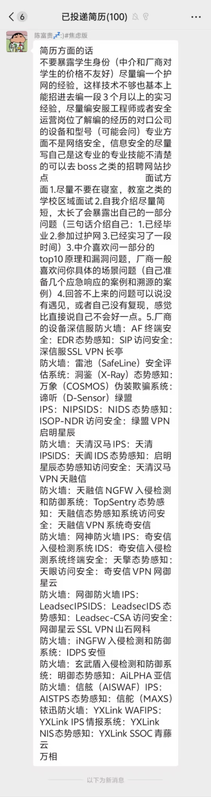

# 安全【待更新】

## 介绍
[安全介绍](../materials/security/introduction.md)

## 入门建议

### 挖洞建议
刚开始挖洞（白盒的话）可以从看复现开始，找那种简单的漏洞复现。然后学习一下这个漏洞代码上的一些特点。学习一下漏洞的“模式”。
比如system()可能有命令执行，strcpy()可能有栈溢出。
还有就是一些关键功能点的，比如登录鉴权啥的。
然后就可以直接开始挖了。虽然现在捡漏难，但是找那种被人打成筛子的框架，可能还是有的。如果有逆向基础可以看看iot，iot设备比较脆弱，挖起来比较容易。

### 安全建议

## 推荐资料
- [CISSP Github学习资料](https://github.com/jefferywmoore/CISSP-Study-Resources)
- [CISSP 备考资料](../materials/security/index.md)

